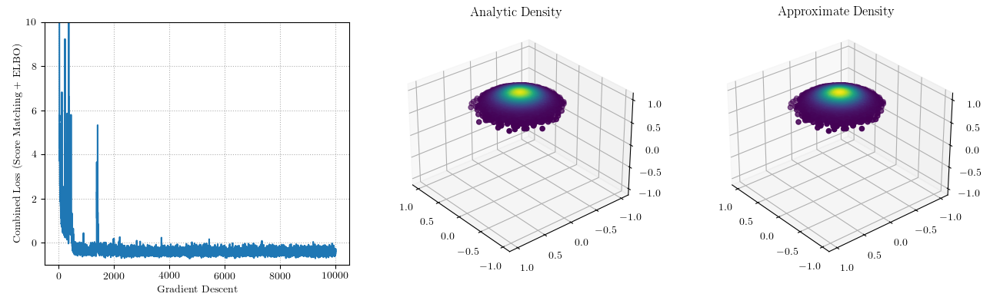

# Score Matching and Dequantization

The objective in these experiments is to give a procedure for forming an estimate of a probability distribution on the sphere given access to an unnormalized density. I found that it was important introduce an ELBO term into the loss function, computed using projected samples from the ambient density (not samples from the target distribution). This encourages the dequantization distribution and the ambient distribution to be close. This is in addition to the score matching loss: the gradient of the importance sample estimate should be close to the gradient of the target density.

Gradients on the sphere are computed by projecting ambient gradients to the tangent space of the sphere. When the metric in the ambient Euclidean space is just the usual dot product, this procedure coincides with the definition of the Riemannian gradient. For details, [see this book](https://web.math.princeton.edu/~nboumal/#book).

In this example we will seek to minimize the score matching loss for a power spherical distribution. Here is a plot showing the score matching loss (which includes an ELBO term) as well as the analytic and estimated probability density on the sphere. The KL divergence of the approximating distribution and the target distribution is 0.00101.

