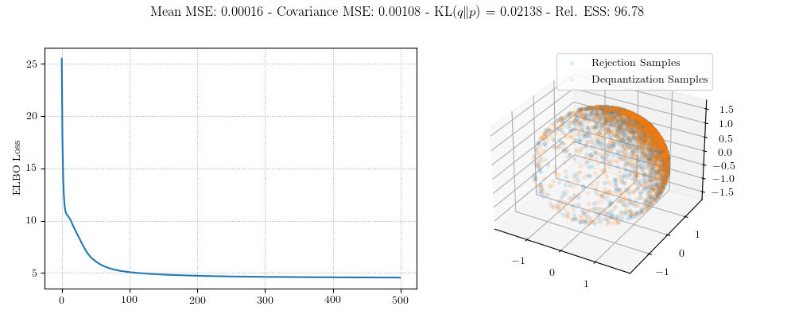
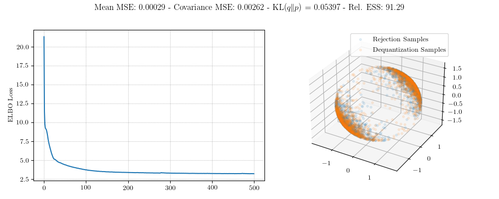

# Dequantization Sampling on O(n)

We can dequantize O(n) by representing an ambient matrix as the product of a matrix O(n) and a Cholesky factor. I consider two distributions on O(n) and I visualize them by their *action* on the vector of ones. This is because I wasn't sure of another convenient visualization for O(n).

The first example is for a unimodal distribution on O(n) which is a "Gaussian" centered at the identity matrix. Here is the training curve, metrics, and visualization.



The second example is a multimodal distribution which has two modes. One is again at the identity and the other is at the pure reflection (the negative identity matrix). Here are the same metrics for this example.



## Reproduction

Here are the invocations to reproduce these experiments.

```
singularity exec --nv ~/scratch60/singularity-containers/manifold-dequantization.sif python orthogonal.py --num-steps 500 --density unimodal
singularity exec --nv ~/scratch60/singularity-containers/manifold-dequantization.sif python orthogonal.py --num-steps 500 --density multimodal --num-ambient 512 --num-dequantization 128
```
