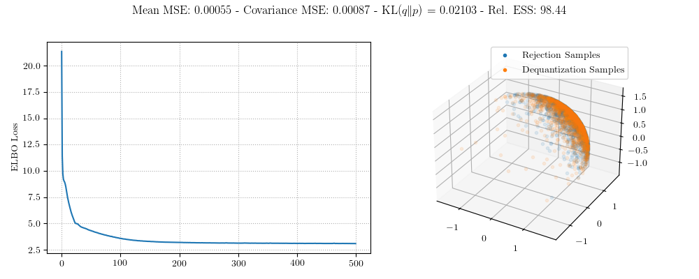
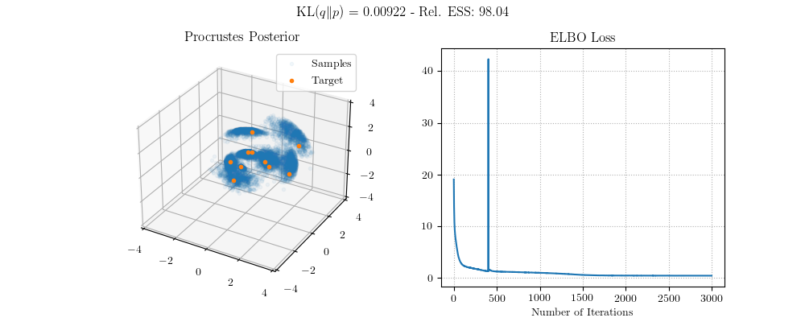

# Dequantization Sampling on O(n)

I have two examples of distributions on O(n). The first is a simple examination of "Gaussian" and "Gaussian mixture" distributions on O(n). The second is Bayesian inference in the Procrustes problem.

## Gaussians on O(n)

We can dequantize O(n) by representing an ambient matrix as the product of a matrix O(n) and a Cholesky factor. I consider two distributions on O(n) and I visualize them by their *action* on the vector of ones. This is because I wasn't sure of another convenient visualization for O(n).

The first example is for a unimodal distribution on O(n) which is a "Gaussian" centered at the identity matrix. Here is the training curve, metrics, and visualization.


## Reduction versus Product Manifold

The second example is to dequantize SO(n). We consider two approaches, which are to construct a distribution on O(n), which is plainly related to the distribution on SO(n). This is the reduction approach. Here are the metrics for this approach.


The second approach is to formulate dequatization as an isomorphism of the ambient space and some product manifold structure. In the case, dequantization becomes marginalization. This yields the following metrics. We see that this second approach is marginally better.



## Procrustes Problem

The [Procrustes Problem](https://en.wikipedia.org/wiki/Orthogonal_Procrustes_problem) is an attempt to identify the orthogonal matrix that best transforms one matrix of observations towards another in terms of the Frobenius norm. I consider sampling from the posterior distribution of the Procruses problem when there is an assumed uniform distribution over the orthogonal group and the (negative) squared Frobenius norm gives the log-likelihood function. Here are the results.



## Reproduction

Here are the invocations to reproduce these experiments.

```
singularity exec --nv ~/scratch60/singularity-containers/manifold-dequantization.sif python orthogonal.py --num-steps 500 --density unimodal
singularity exec --nv ~/scratch60/singularity-containers/manifold-dequantization.sif python orthogonal.py --num-steps 500 --density multimodal --num-ambient 512 --num-dequantization 128
singularity exec --nv ~/scratch60/singularity-containers/manifold-dequantization.sif python orthogonal_marginal.py --num-steps 500 --density multimodal --num-ambient 512 --num-dequantization 128
singularity exec --nv ~/scratch60/singularity-containers/manifold-dequantization.sif python procrustes.py
```
