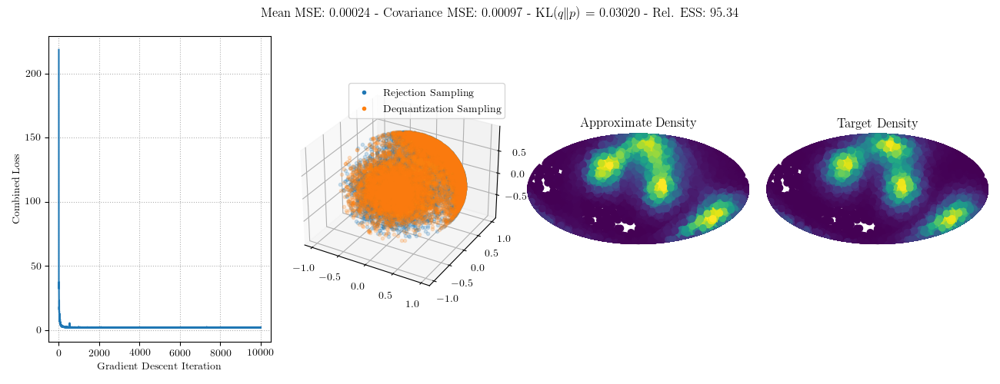
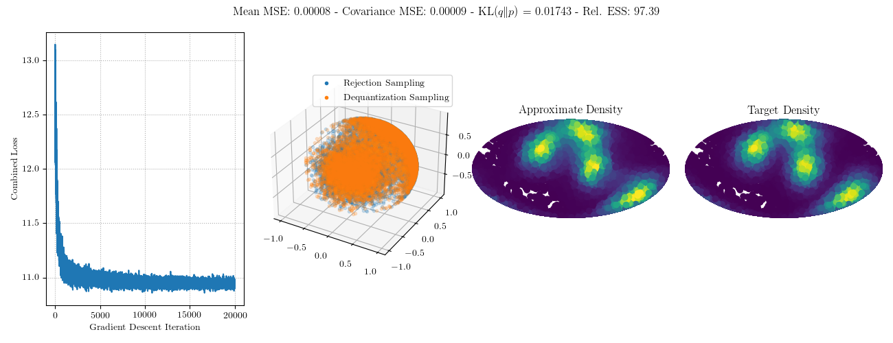
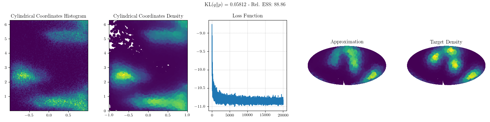
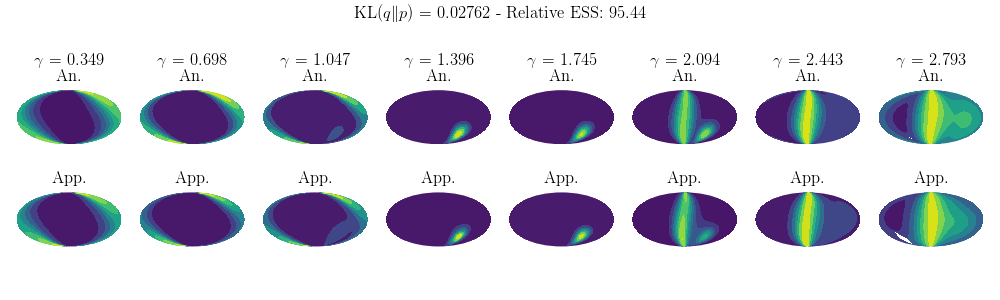
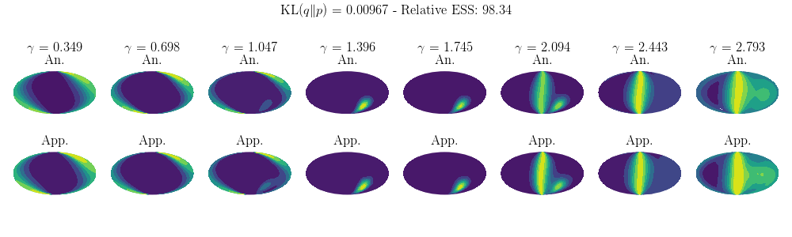
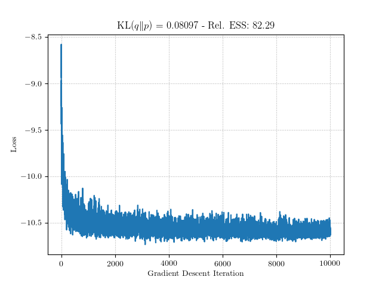

# Density Estimation on Spheres


This module examines densities on the spherical manifold. The experiments seeks to replicate the experimental setup in [Normalizing Flows on Tori and Spheres](https://arxiv.org/abs/2002.02428).

## Density on 2-Sphere

The first density is defined in equation (28) in Normalizing Flows on Tori and Spheres. We will compare two methods for performing density estimation on the manifold.

1. Minimizing the ELBO on the manifold.
2. Minimizing KL(p || q) on the manifold, wherein the approximating density is itself approximated via importance sampling.

We give visualizations of these results in the following figures. The first shows results for learning with the ELBO loss function and the second for the KL-divergence loss function. Ten importance samples are used during training to compute the KL-divergence loss.




We see that training with the KL divergence loss produces both better KL(q || p) and relative ESS compared to ELBO minimization. As a point of comparison, we compare dequantization with the Mobius-spline transformation from Normalizing Flows on Tori and Spheres. We see that either of the dequantization methods perform better than the Mobius-spline flow.



Here are the invocations to reproduce these experiments.
```
singularity exec --nv ~/scratch60/singularity-containers/manifold-dequantization.sif python sphere.py --num-steps 10000 --density sphere --elbo-loss 1 --lr 1e-4 --num-importance 10
singularity exec --nv ~/scratch60/singularity-containers/manifold-dequantization.sif python sphere.py --num-steps 10000 --density sphere --elbo-loss 0 --lr 1e-4 --num-importance 10
cp ../../sphere-flow/images/mobius-spline-density.png images/
```

# Density on 3-Sphere

We next consider the density defined on page 14 of Normalizing Flows on Tori and Spheres (there is no equation number). We again compare ELBO minimization with direct KL(p || q) minimization. We visualize some slices of the approximating density and the target distribution, in addition to the relative effective sample size. The first is for ELBO minimization and the second for KL divergence minimization.




As in the case of the 2-sphere, it appears that training with KL-divergence yields better KL(q || p) and ESS metrics. We again compare against Mobius spline flows. I find that the Mobius-spline flow performs worse in KL and ESS.



Here are the invocations to reproduce these experiments.
```
singularity exec --nv ~/scratch60/singularity-containers/manifold-dequantization.sif python sphere.py --num-steps 10000 --density hyper --seed 5 --elbo-loss 1 --num-importance 10
singularity exec --nv ~/scratch60/singularity-containers/manifold-dequantization.sif python sphere.py --num-steps 10000 --density hyper --seed 5 --elbo-loss 0 --num-importance 10
cp ../../sphere-flow/images/hypersphere-mobius-spline.png images/
```
