# Dequantizing Densities on Torus

This module examines dequantizing densities defined on tori. A torus can be represented as a the product manifold of two circles. For dequantization, our approach will be to dequantize these circles into an ambient Euclidean space. We consider three distributions defined on the torus: (i) a unimodal density, (ii) a multimodal density, and (iii) a correlated density, which I have aimed to reproduce from Table 2 in Normalizing Flows on Tori and Spheres.

## Unimodal Density

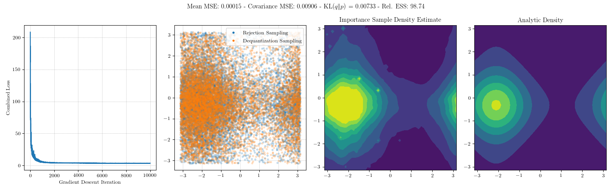
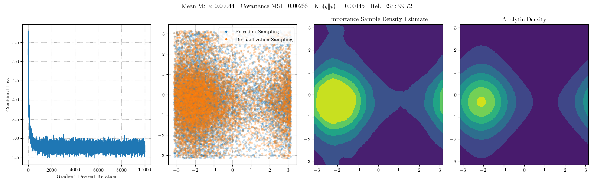
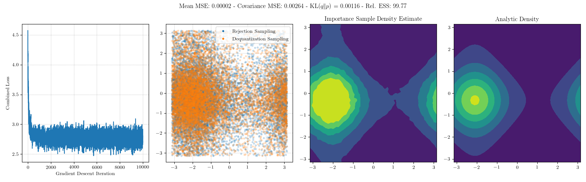
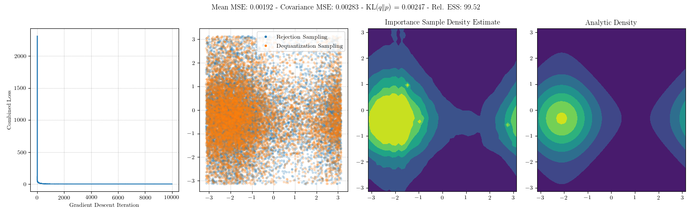

Here is the comparison against the Mobius-spline flow for the unimodal density.

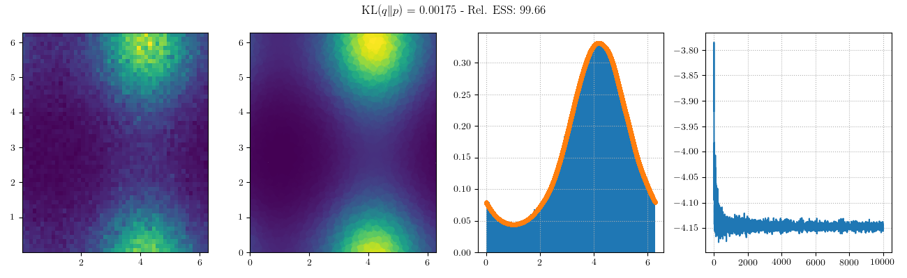

## Multimodal Density

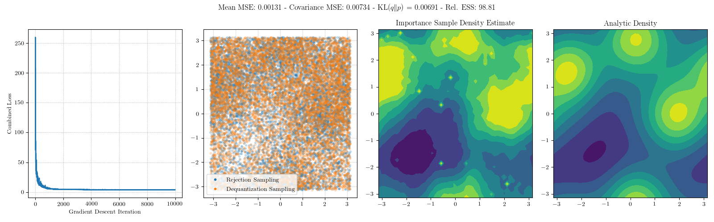
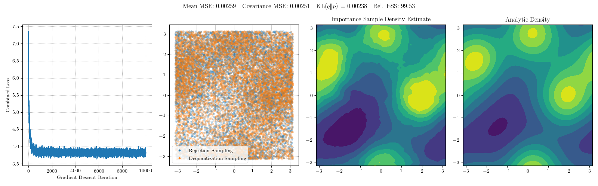
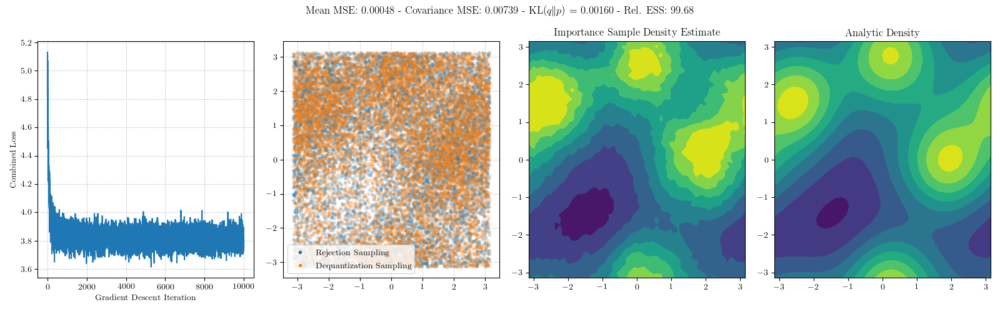
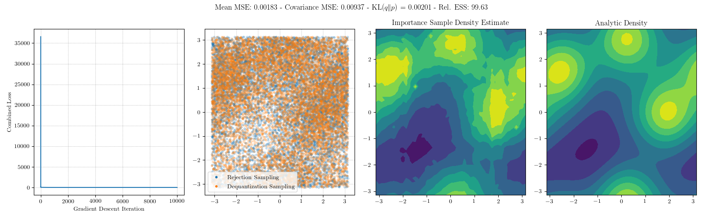

Here is the comparison against the Mobius-spline flow for the multimodal density.

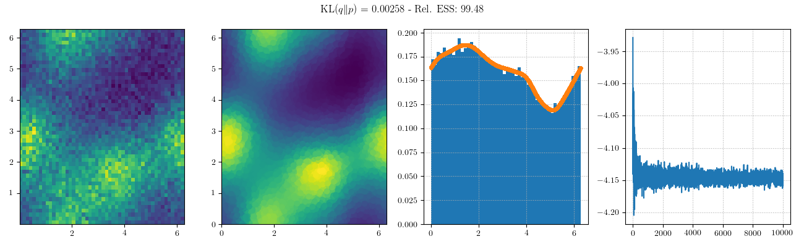

## Correlated Density

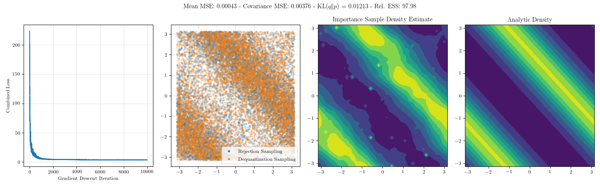
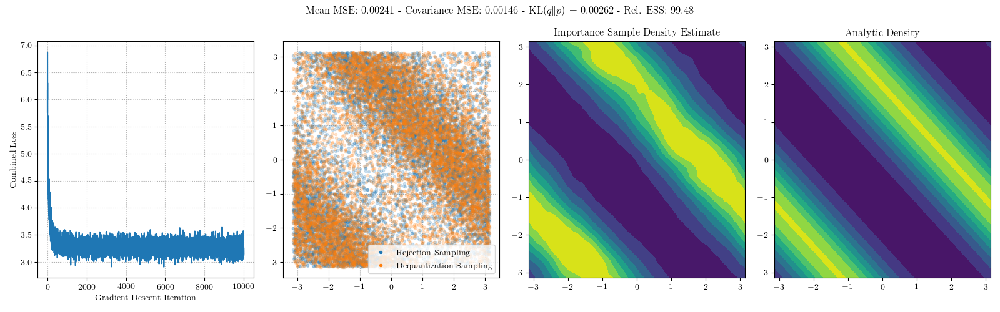
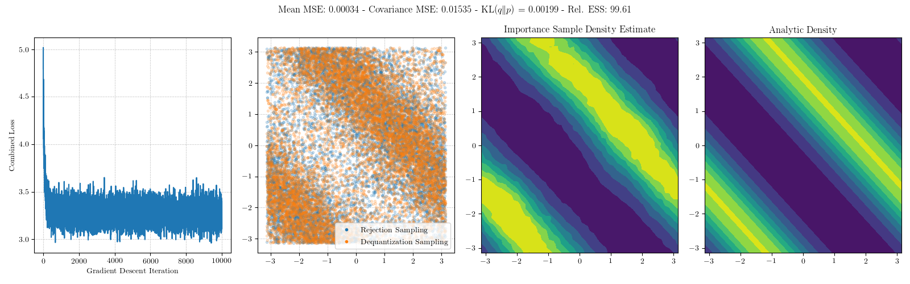
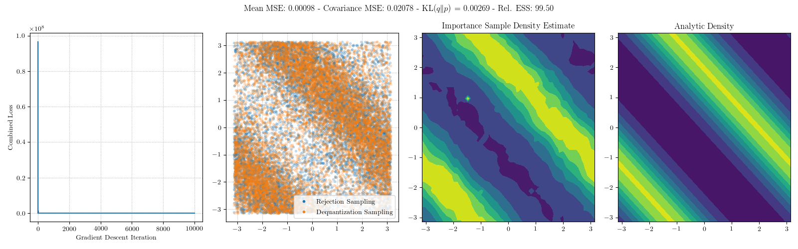

Here is the comparison against the Mobius-spline flow for the correlated density.

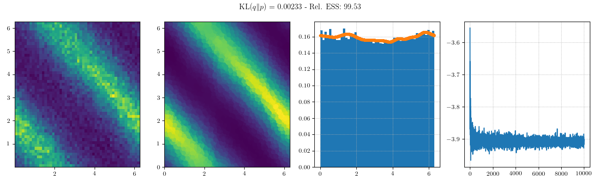

Invoke the following to reproduce these results.
```
dSQ --jobfile joblist.txt -p gpu --gres=gpu:1 --gres-flags=enforce-binding -t 24:00:00 -c 10 --job-name torus -o output/torus-%A-%J.log --submit --suppress-stats-file
cp ../../sphere-flow/images/torus-unimodal-density.png images/
cp ../../sphere-flow/images/torus-multimodal-density.png images/
cp ../../sphere-flow/images/torus-correlated-density.png images/
```
