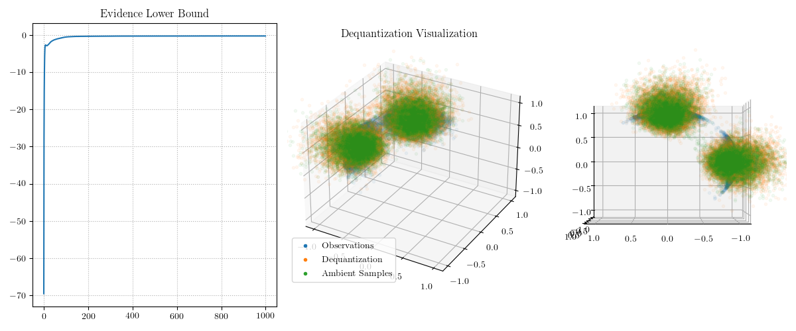
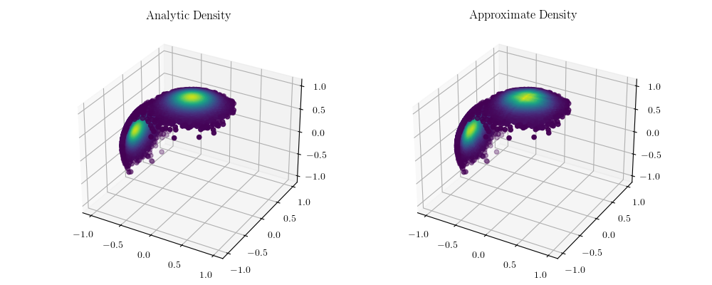

# End-to-End Dequantization of Power Spherical Mixture

This example gives code for sampling from a mixture of power spherical distributions using end-to-end dequantization. End-to-end dequantization means that the parameters of the variational dequantization distribution and the parameters of the ambient flow are estimated simultaneously given observations on the sphere. 

I think the most important lesson-learned from this experiment is that the dequantization has to avoid dequantizing the manifold to a "point of high ambiguity" by which I mean a point in the ambient space for which a nearby point might project to a far-away point on the manifold. For instance, the zero vector is a point of high ambiguity because subtle perturbations around that point will produce wildly different projections. In order to encourage the dequantizing distribution to avoid having mass at points of high ambiguity I use in this example a dequantizer of the form `x -> (1 + z) * x` where `x` is a point on the sphere and `z` is a log-normal random variable. As in previous examples, the mean and variance of the log-normal random variable can be parameterized via a neural network.

Here are training curves and a visualization of the dequantization from two angles.



## Update August 29th, 2020

I have eliminated the need to bias the dequantization distribution (which was to force it to dequantize to points with norm greater than one). This was accomplished by simply reparameterizing the dequantization distribution. Rather than having a neural network model the mean of the log-normal dequantizer, I instead have it produce the log-mean, which is then exponentiated. This was enough to give stable ELBO estimates and a convincing dequantization, while still preserving the ability to dequantize anywhere in the ambient space with some probability. See the above figure for an example.

The second direction was to investigate importance sampling as a means of computing the estimated density on the manifold. I have implemented this and below one may compare the analytic density of the power spherical mixture and the importance sample approximation. The estimated KL-divergence between the approximation and the target distribution is 0.03401; as a point of comparison, the KL-divergence between the Haar distribution on the sphere and the target distribution is 20.28852. There is a clear improvement in this respect. Here is a visual comparison of the densities with the same color scale applied to either subplot.



## Video of Samples

I have also made a video to compare actual samples from the mixture of power spherical distributions and the samples obtained by dequantization. There appears to be an anomaly at the border of the two mixture components wherein a cluster of spurious projections can be found.
 


## Video Generation

To make the video you must have `ffmpeg` available. Run the following commands.
```
singularity exec --nv ~/scratch60/singularity-containers/manifold-dequantization.sif ffmpeg -y -r 60 -f image2 -s 1920x1080 -i video-frames/spherical-samples-%05d.png -vcodec libx264 -crf 25  -pix_fmt yuv420p images/dequantization.mp4
```
