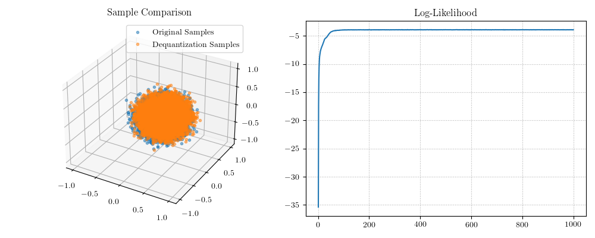
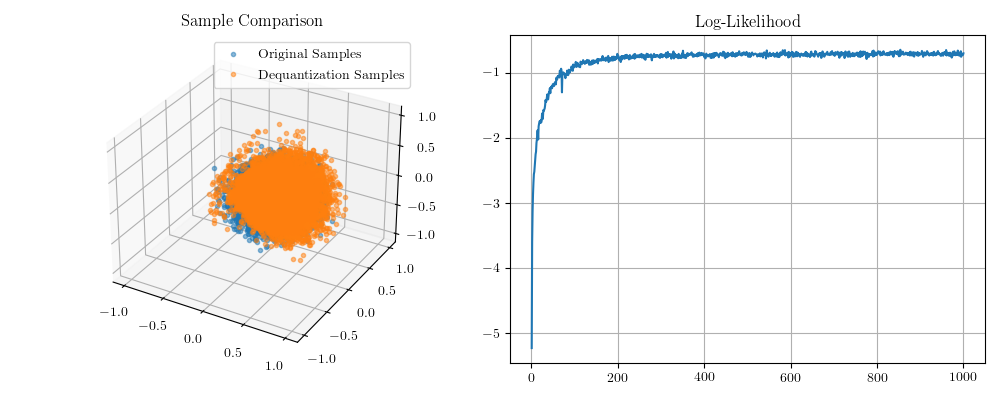

# Dequantizing the Power Spherical Distribution

This module implements dequantization sampling of the [power spherical distribution](https://arxiv.org/abs/2006.04437). Sampling is implemented as a two-stage process:

1. Dequantize the distribution by maximizing the evidence lower bound. This gives a distribution in an ambient dequantized space.
2. Train a normalizing flow in the ambient space to match the dequantized distribution.

Samples may be obtained from the manifold by sampling from the normalizing flow and projecting back onto the manifold.

For distributions on spheres, a natural projection from the ambient space to the sphere is divide a point in the ambient space (not equal to zero) by its norm. Using this as the retraction, we must enforce that the method of dequantization does not cause the dequantized point to project back somewhere else. To achieve this, I consider dequantizing a point `y` on the sphere by `x = LogNormal(mu(y), sigmasq(y)) * y`; since the log-normal distribution has non-negative support, such a dequantization will preserve the correct projection. Note that the mean and variance of the log-normal distribution may be parameterized by a neural network, for instance.

## Visual Inspection

The first check is that the ELBO increases as we optimize the parameters of the log-normal dequantizing distribution. This indeed appears to be the case.


Once the dequantizing distribution has been trained, we can train an ambient normalizing flow in order to do density estimation in the ambient space. Here are the results of using the trained dequantizing distribution and estimating an ambient normalizing flow (using RealNVP), and projecting samples of the ambient density back onto the sphere; the normalizing flow is trained using one-thousand gradient ascent iterations on the log-likelihood.



Visually, the projected ambient samples (orange) look like a good match to actual samples from a power spherical distribution. Does training the dequantization distribution to maximize the ELBO matter? Here is the same figure but in the case where no attempt is made to optimize the parameters of the log-normal dequantizing distribution.



Apparently, the match between the power spherical distribution and projected ambient samples is degraded in this situation. Still, the projected samples aren't absolutely terrible; this suggests to me that the RealNVP ambient flow may be the more important component than maximizing the ELBO.

## Numerical Comparison

Instead of visually comparing samples, we can instead look at how well the projected samples match the mean and covariance structure of the actual power spherical distribution. These are as follows, first for the case of no ELBO maximization.
```
difference between means:       0.01947 - relative error: 0.02025
difference between covariances: 0.01511 - relative error: 0.28851
```
On the other hand when we maximize the ELBO of the dequantizing distribution.
```
difference between means:      0.00803 - relative error: 0.00835
difference between covariance: 0.00286 - relative error: 0.05467
```
We observe that maximizing the evidence lower bound yields a dequantization sampler whose moments better approximate the actual mean and covariance structures of the power spherical distribution.
