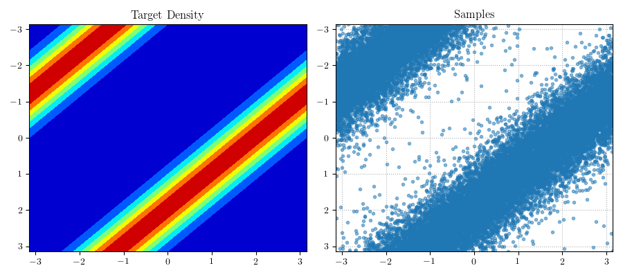
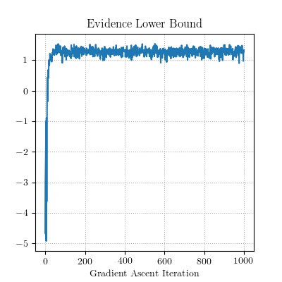
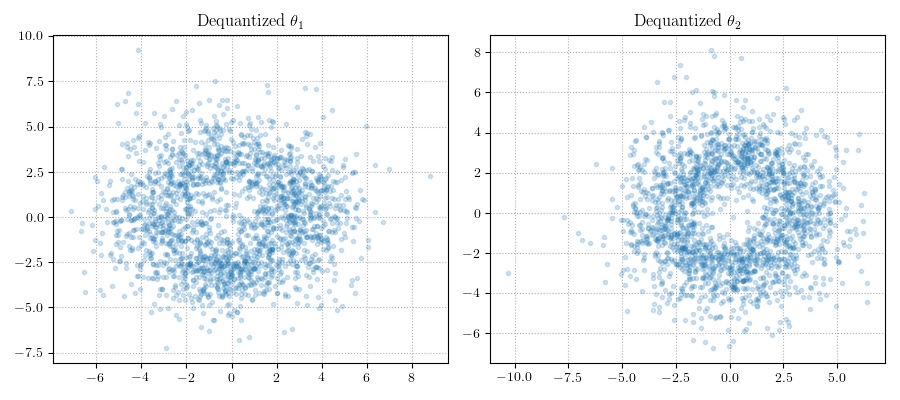
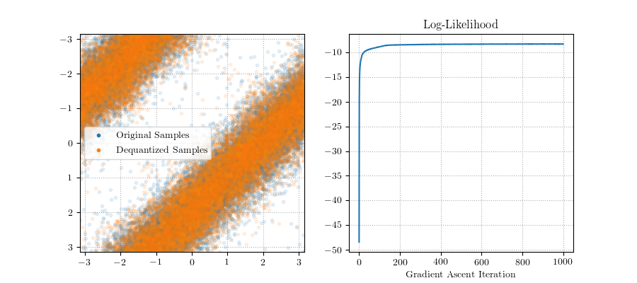
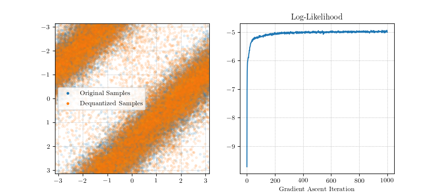

# Dequantizing Torii

In this example I'll consider matching a density on a torus via dequantization. As a specific example, I am considering the "correlated" distribution from Table 2 in [Normalizing Flows on Torii and Spheres](https://arxiv.org/abs/2002.02428). My first purpose is to obtain samples from such a distribution that I can then dequantize. For this purpose I use rejection sampling. The results are shown in the figure below. We see that the samples appear to match to modes of the target density.

Having obtained samples we may proceed to the two-step process of dequantization sampling. First, we will maximize the evidence lower bound of a dequantizing distribution. Second, I will estimate a normalizing flow in the ambient two-dimensional space. By identifying the two-dimensional torus with the product manifold of two circles, a natural projection for the torus can be obtained by identifying each angular coordinate of the torus with a point on the unit circle; a point in the product space of two planes may then by quantized to the manifold by dividing the location in the first plane by its norm and, similarly, the second point by its norm.

Given a point `y = (a, b)` on the product manifold of two circles (so `a` and `b` are individually on the unit circle), I consider a dequantizing distribution according to `a' = LogNormal(mua(y), sigmasqa(y)) * a` and `b' = LogNormal(mub(y), sigmasqb(y)) * b` and let `x = (a', b')`. As described prevision, projecting `x` back to the manifold is achieved by `(a', b') -> (a' / || a' ||, b' / || b' ||)`. As in the power spherical distribution example, the parameters of the log-normal dequantizer are given by neural networks.

The ambient prior distribution is chosen as `Normal(||x|| ; 5, 1)`. Maximizing the ELBO gives the following figure.

Moreover, we see by inspection of the dequantization of the two angular coordinates that the distribution in the ambient space looks something like the prior.

The second stage of the dequantization process is to estimate an ambient normalizing flow. As the dequantized distribution lives in four-dimensional Euclidean space, we require a four-dimensional normalizing flow. I consider for this purpose the composition of three RealNVP bijectors with permutations of the variables in between each RealNVP instance. Sampling from the RealNVP and projecting back to the manifold yields the following figure where I also show the log-likelihood by iteration.

Once again we can ask if maximizing the ELBO makes a difference. Here indeed it does: when the same process is repeated without any attempt to tune the dequantization parameters we get the following results. Notice that there appear to be too many points in the space between modes of the distribution, indicating a sampling bias.

